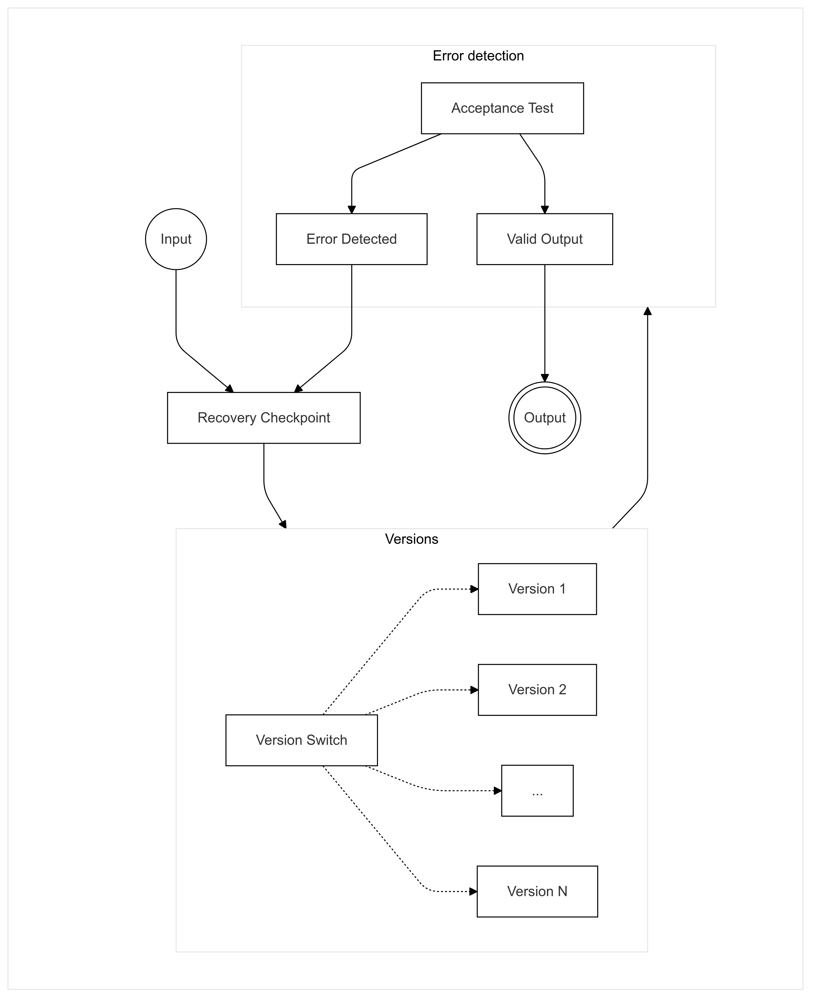
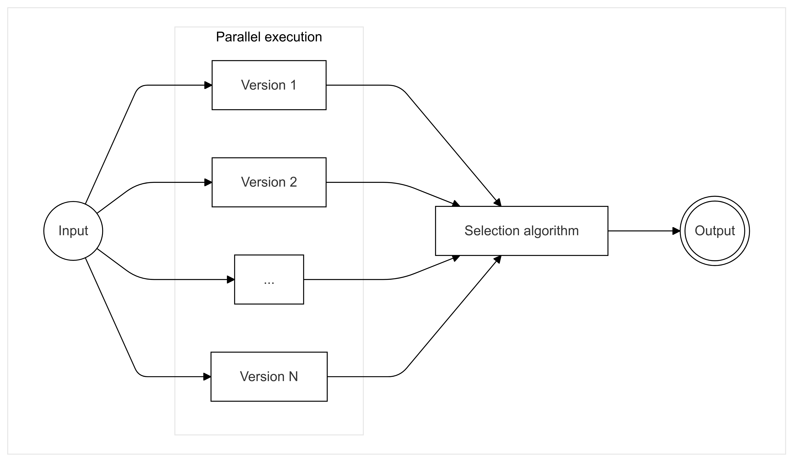

\title{\Huge \textbf{Software-Implemented Fault Tolerance}}
\author{Filip Ďuriš}

\maketitle

\newpage

# 1. Types of errors

Errors can be caused numerous factors, some of which are under the control of developers and some which are not. Generally speaking, we can split errors into two categories - hardware and software errors.

## 1.1 Hardware errors

Hardware errors are caused by external factors beyond our control, as a software developer, such as radiation in space or adverse weater conditions on Earth. In order to create robust and reliable software, which can continue operation when when hardware errors do occur, we must implement software redundancies which maximize the likelyhood of the software executing correctly under all conditions.

The most common hardware error is memory corruption. Memory corruption can be caused by many factors and appear in various forms. An exampl of memory corruption might be a region of the file-system being tampered with due to physical damager, or just a single bit being flipped in RAM as a result of radiation.

A common factor between hardware errors is their unexpected nature and their ability to result in both complete system corruption resulting in unrecoverable state, but also the possibility of small, hard-to-detect corruptions which might be visibly impact the functioning of the software.

## 1.2 Software errors

Software errors are mistakes or flaws within our control as software developers, often stemming from issues in the development process itself. These errors are typically caused by improper handling of user inputs, faulty logic, or inadequate resource management, among other issues. Recognizing that software will likely contain bugs, regardless of development rigor, is essential to creating resilient and fault-tolerant applications. Accepting the inevitability of bugs allows developers to incorporate strategies for managing potential failures.

To ensure that software remains robust and as free of errors as possible, there are several effective strategies. One promising approach is the use of memory-safe programming languages, specifically Rust. Rust is a modern language that has gained traction for its safety features, particularly in system programming and embedded applications. It ensures high performance through zero-cost abstractions and introduces an innovative memory ownership model, which reduces memory-related errors such as null pointer dereferencing and data races. This model makes Rust particularly well-suited for low-level and resource-constrained environments, where reliable memory management is crucial. (https://docs.rust-embedded.org/book/)

# 2. Fault tolerant software

## 2.1 Single version vs multi-version

## 2.2 Single version

Single version is a technique which focuses on adding safety checks and redundancies into a singular version of the software, that make it the most resilient against error and external factors.
This includes detection of faults and ability to recover from them.

### 2.2.1 Modularity

### 2.2.2 Error detection

### 2.2.3 Exception handling

### 2.2.4 Checkpoint and restart

## 2.3 Multi-version

Multi-version relies on multiple different version of the same software, where the failure of a single variant does not have an impact on the overall system.
Multiple versions of the same software are exectues either in sequence or in parallel, each utilizing different error detection and recovery, to have the higest probability of at least one completing the task successfully.

### 2.3.1 Recovery blocks

The recovery blocks technique builds upon the principles of single-version programming for error detection while adding redundancy to enable recovery. When an error is detected, the recovery blocks system switches to an alternate version of the software to continue execution, effectively allowing the program to recover from failures. This makes recovery blocks an extension of multi-version programming with a focus on error resilience.

In practice, recovery blocks create a “recovery checkpoint” prior to executing a version of the software. This checkpoint captures the software's state immediately before execution, allowing the system to revert to this state if an error occurs during processing. If the initial version fails, the system rolls back to the checkpoint and proceeds with a different version, which enhances fault tolerance. This approach not only isolates errors but also enables rapid recovery by preventing errors from propagating, thus preserving the stability and continuity of the overall system.

_Figure 1: Recovery Blocks_

A key advantage of the recovery blocks technique is that, in most cases, the initial version will execute successfully, allowing subsequent versions to prioritize redundancy and safety over performance. This enables the design of backup versions with gradually reduced performance requirements, ensuring robust fallback options without excessive resource consumption.

Since errors are relatively rare compared to normal execution, this approach often achieves an optimal balance of performance and reliability. By prioritizing efficiency in the primary execution path while incorporating progressively resilient alternatives, recovery blocks can provide dependable fault tolerance without compromising system performance in typical operating conditions. This balance makes recovery blocks a practical solution for systems requiring high availability and reliability.

A considerable drawback of recovery blocks approach is its inherent complexity which creates numerous failure points. Namely during error detection and state recovery. Since we are performing error detection on a singular execution of a version, we have no way to detect errors which coincide with normal functioning of the software, e.g. random bit flips in used variable. Errors such as these would result in incorrect output from a version, but would be undetectable provided the memory corruption is minimal. Even if we do detect an error, we have no guarantee that the state which was saved is not corrupted as well. We would need to employ various techniques to detect a corrupted recovery checkpoint and ideally implement redundancies to ensure the state can be restored.

This creates a lot of overhead and might not be ideal for application where minimal memory footprint is needed.

### 2.3.2 N-version programming

N-version programming extends the multi-version technique by running the same task in parallel across multiple, independent versions, typically referred to as “N versions.” In this approach, each version independently performs the task, and the final outcome is determined through a consensus mechanism that evaluates the results from all N executions.

This consensus is usually achieved through a voting algorithm, which aggregates the outputs from each version and selects the result agreed upon by the majority, thereby reducing the likelihood of errors impacting the system. By leveraging redundancy and voting, N-version programming enhances system reliability and fault tolerance. However, implementing this technique requires careful design to ensure that each version performs equivalently yet independently, minimizing correlated failures and maximizing the robustness of the overall system. Additionally, the increased complexity of maintaining multiple synchronized versions demands significant testing and validation efforts to ensure accurate and efficient performance across all versions.

_Figure 2: N-Version Programming_

The primary drawback of N-version programming is its requirement to execute all versions either in parallel or sequentially before determining the final output. This can be highly resource-intensive, especially for large or complex tasks, as it necessitates significant computational power and memory to run multiple versions simultaneously.

For systems with limited resources, such as embedded systems, this approach can be particularly inefficient. The need to allocate resources for each version can strain the system’s capabilities, potentially reducing its overall performance and responsiveness. As a result, while N-version programming enhances fault tolerance and reliability, it may not be suitable for applications where resource constraints are a priority or where processing efficiency is critical.

A consideration for N-version programming is the possibility of error not being random indpendent event, but rather a function of the input variable. (https://ieeexplore.ieee.org/document/5326). Therefore, even multiple version running in parallel could all fail and give erroneous results. This makes the selection algorithm a critical failure point which N-version programming on its own does not address.

### 2.3.3 N Self-checking programming

### 2.3.4 t/(n-1)-Variant programming

### 2.3.5 Drawbacks of multi-version programming

The primary challenge associated with multi-version programming is the significant effort required to develop, test, and maintain several versions of software that perform the same function. This process can be resource-intensive, leading to increased costs and inefficiencies that may be prohibitive for smaller projects or for teams with limited budgets.

To achieve effective multi-version programming, each version must be carefully designed to execute the same task while incorporating distinct failure mechanisms. Ensuring that no two versions fail in the exact same way is crucial for building reliable and fault-tolerant systems. This approach allows for enhanced redundancy, as one version can continue to operate even if another encounters a specific failure mode. While this increases the robustness of the system, it also demands rigorous validation to ensure that each version is independently reliable and that the software as a whole remains cohesive across all iterations.
