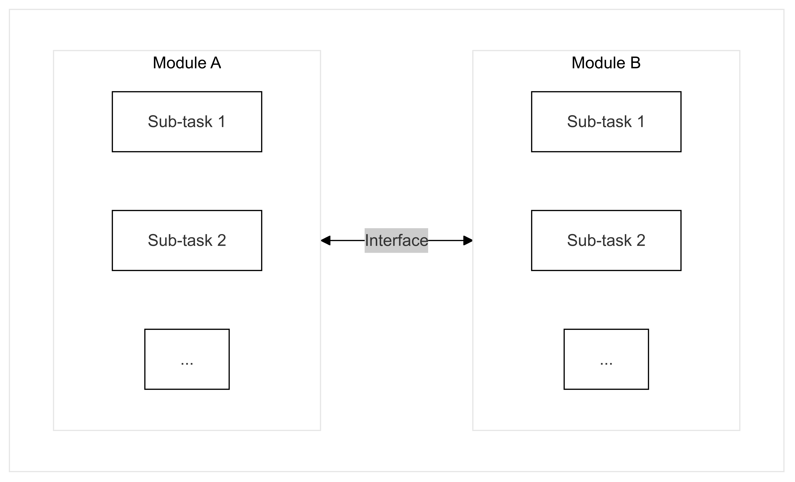
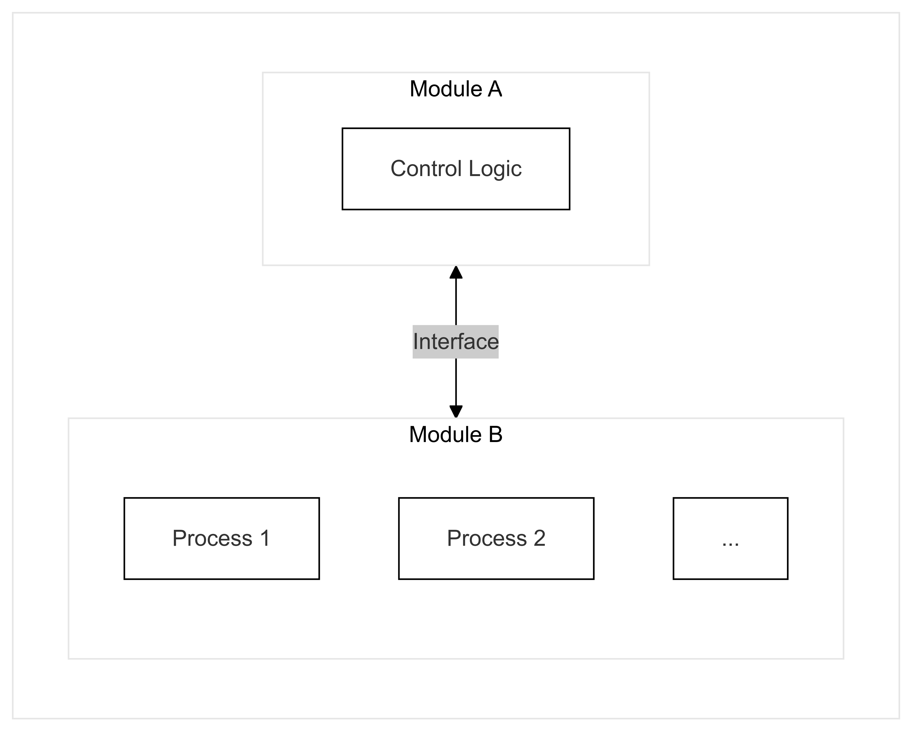

\documentclass{article}
\usepackage[
backend=biber,
style=alphabetic,
]{biblatex}
\addbibresource{sources.bib}

\title{\Huge \textbf{Software-Implemented Fault Tolerance}}
\author{Filip Ďuriš}

\begin{document}

\maketitle

\newpage

\section{Abstract}

_With the increasing demand for high-performance embedded software comes the inevitable,difficult task of ensuring fault-free functioning of ever-more complex systems. The increased complexity, both in terms of hardware components and software features, increases the number of failure points where errors can occur._

_Errors can be caused by both external factors beyond our control such as radiation in space, but also as a result of human error while designing the software. Due to the incredibly complex nature of this problem, it is unlikely we will be desiging completely error-free software and hardware in the near future. This simple fact makes fault-tolerance an important aspect of software design, especially when designing critical systems whose failure could endanger human life. However, as with most things, fault-tolerance and reliability is a tradeoff, which usually comes at the cost of performance, development time and cost._

_This paper will aim to analyze various commonly implemented fault-tolerance methods. We will looks at the benefits and drawback of the utilized methods, as well as construct a working demo based on FreeRTOS implementing and testing the effectiveness of some selected methods._

\newpage

# 0. Taxonomy

For the sake of consitency in the nomenclature used in this paper, we will be referencing the naming conventions and definitions as outlined by [A. Avizienis](https://ieeexplore.ieee.org/stamp/stamp.jsp?tp=&arnumber=1335465). \cite{1335465} Below is a listing of the most crucial terms used in this paper and their definitions.

### Failure

Failure is an event that occurs when the delivered service deviates from correct service. A service fails either because it does not comply with the functional specification, or because this specification did not adequately describe the system function. A service failure is a transition from correct service to incorrect service, i.e., to not implementing the system function.

### Error

Error is a deviation of the service from its correct state. It is a part of the system's state that may lead to service failure. Errors are the result of issues within the software, an example might be the lack of input sanitization, possibly leading to unexpected values as input.

### Fault

Fault is the actual or hypothesized cause of a error. Faults are usually considered dormant until manifested, causing an error. An example of a fault might be hardware issue causing an I/O device to send corrupted data as input. If the software is not designed to deal with incorrect input this would lead to an internal error, possibly causing a service failure.

Faults can be further split into various categories, the ones mostly relevant to use are **external faults** which originate from outside the system boundaries and propagate into the system. Which also includes **natural faults** that are caused by natural phenomena without human particiaption. These faults can the hardware and the software, which is why we can further classify them as **hardware faults** and **software faults**.

### Fault tolerance

Is the ability to avoid service failures in the presence of faults.

# 1. Types of faults

Errors can be caused by numerous factors, some of which are under the control of developers and some which are not. Generally speaking, we can split errors into two categories - hardware errors - these are predominantly out of our control as developers, and software errors - these errors are usually within our control, but due to various factors are still an important consideration when designing software.

## 1.1 Hardware faults

Hardware errors are caused by external factors beyond our control as software developers. They are usually caused by environmental influences, such as cosmic radiation in space, electro-magnetic fields or adverse weater conditions. In order to create robust and reliable software, which can continue operation even when hardware errors do occur, we must implement software redundancies which maximize the likelyhood of the software executing correctly under all conditions.

One of the most common hardware errors is memory corruption, which can appear in many forms and result from a wide range of causes. For instance, radiation exposure in space can cause single-event upsets (SEUs), flipping individual bits in memory and altering data unpredictably. Similarly, physical damage to storage media, such as hard drives or SSDs, might corrupt specific regions of the file system, making certain data inaccessible or incorrect.

Memory corruption is not always catastrophic. While it can result in complete system failure and unrecoverable states, it is just as likely to manifest as small, hard-to-detect errors. These subtle corruptions might not immediately disrupt the software's functioning but can lead to unpredictable behavior over time.

A defining characteristic of hardware errors, including memory corruption, is their unpredictability. This makes it essential to implement robust fault-tolerance strategies, such as error detection and correction codes (ECC) in memory, periodic integrity checks, and recovery mechanisms to verify and restore corrupted states. These measures ensure that systems remain operational even when errors occur, minimizing the impact of hardware faults on overall reliability.

## 1.2 Development faults

Software faults, introduced during the development process, are considered development faults. These errors are typically caused by improper handling of user inputs, faulty logic, or inadequate resource management, among other issues. Recognizing that software will likely contain bugs, regardless of how much effort we put into it, is essential to creating resilient and fault-tolerant applications. Accepting the inevitability of bugs allows developers to incorporate strategies for managing potential failures.

To ensure that software remains robust and as free of errors as possible, there are several effective strategies. One promising approach we will look at is the use of memory-safe programming languages, specifically Rust. Rust is a modern language that has gained traction for its safety features, particularly in system programming and embedded applications. It ensures high performance through zero-cost abstractions and introduces a memory ownership model, which reduces memory-related errors such as null pointer dereferencing and data races. This model makes Rust particularly well-suited for low-level and resource-constrained environments, where reliable memory management is crucial. (https://docs.rust-embedded.org/book/)

# 2. Fault tolerant software

## 2.1 Single version vs multi-version

## 2.2 Single version

Single version is a technique which focuses on creating a singular, robust implementation of software by integrating safety checks and redundancies directly into its design. The primary aim of this approach is to make the software as resilient as possible to errors and external factors, ensuring reliable operation under a wide range of conditions.

This technique emphasizes the detection of faults within the software and the ability to recover from them. Fault detection typically involves monitoring the system for unexpected behaviors or inconsistencies, which could signal the presence of an error. Recovery mechanisms then act to mitigate the effects of these faults, either by correcting them or transitioning the system into a stable, functional state.

Drawbacks of single version techniques are primarily the lack of alternatives and fallbacks, should the version fail. Single-version techniques heavily rely on error detection and recovery, which might not always work in practise.

### 2.2.1 Modularity

Perhaps the simplest way we can create a more resilient software is to structure it into independed modules. Each module should handle one task and, when possible, not directly rely upon any other modules for its functionality, or be relied upon by other modules.

A technique commonly utilized to achieve modularity is partitioning, which can be divided into horizonatal and vertical partitioning. Horizontal partitioning aims to split the software into independent structural branches communicating through interfaces. Vertical partitioning splits the software in a top-down fashion, where higher level modules are tasked with control logic while lower level modules do most of the processing (https://ntrs.nasa.gov/api/citations/20000120144/downloads/20000120144.pdf).

_Figure 1: Horizontal partitioning_

_Figure 2: Vertical partitioning_

Benefit of partitioning is the ability of software to isolate errors. Provided the sofware is correctly structured, an error occuring in a single module should not propagate to other modules. Meaning we can use modularity as a way to pinpoint the erroneous parts of software and attempt recovery. If recovery is not possible, the software should still be able to partially function, given that other parts of the software are not influenced by the fault. In most situations, partial functioning of a software is preferrable to a complete shutdown.

### 2.2.2 Error detection

Fault-tolerant single-version application should meet two main criteria: self-protection and self-checking. Self-protection means that the application should be able to protect itself from external corruption by detecting errors in information being passed into the application. Self-checking means that the application component must be able to detect errors within itself and prevent propagation of these errors into other components. These two traits combined can be together considered as the ability of "error detection".
(https://ntrs.nasa.gov/api/citations/20000120144/downloads/20000120144.pdf)

Error detection covers a wide range of techniques used to locate errors and mittigate them. Some common approaches include:

a) checksums and error correction codes (ECC), which embed additional metadata with the actual data in order to verify integrity and attempt to correct corrupted data. This approach allows for some degree of memory corruption mitigation but comes at the cost of memory overhead and additional processing per data-chunk which uses checksum or ECCs.

b) assertion and runtime checks, which perform independent checks on the data during execution which ensures the data matches the expected outcomes at certain checkpoints. This approach also carries with it the additional processing overhead without guarantees that we will be able to catch all errors.

c) watchdog timers, whose main purpose is to catch deadlock states by giving a task a certain amount of time to exectue before aborting it.

Error detection is a crucial aspect of single-version application, since we have no alternate version to fall back upon (see section 3).

### 2.2.3 Exception handling

### 2.2.4 Checkpoint and restart

## 2.3 Multi-version

Multi-version relies on multiple different version of the same software, where the failure of a single variant does not have an impact on the overall system.
Multiple versions of the same software are exectues either in sequence or in parallel, each utilizing different error detection and recovery, to have the higest probability of at least one completing the task successfully.

### 2.3.1 Recovery blocks

The recovery blocks technique builds upon the principles of single-version programming by adding redundancy to support fault recovery. In this approach, when an error is detected, the system transitions to an alternate version of the software, enabling continued execution despite the failure. This positions recovery blocks as an extension of multi-version programming, with a strong emphasis on error resilience.

In practice, recovery blocks work by creating a “recovery checkpoint” before executing a version of the software. This checkpoint records the system’s state at that moment, ensuring that the software can roll back to it if an error occurs. If the initial version fails, the system reverts to the checkpoint and executes a backup version instead. This process not only prevents the propagation of errors but also ensures rapid recovery, maintaining system stability and continuity. By isolating faults and providing fallback options, recovery blocks enhance fault tolerance while minimizing the impact of errors on overall functionality.

_Figure 3: Recovery Blocks_

A key advantage of the recovery blocks technique is that, in most cases, the initial version will execute successfully, allowing subsequent versions to prioritize redundancy and safety over performance. This enables the design of backup versions with gradually reduced performance requirements, ensuring robust fallback options without excessive resource consumption.

Since errors are relatively rare compared to normal execution, this approach often achieves an optimal balance of performance and reliability. By prioritizing efficiency in the primary execution path while incorporating progressively resilient alternatives, recovery blocks can provide dependable fault tolerance without compromising system performance in typical operating conditions. This balance makes recovery blocks a practical solution for systems requiring high availability and reliability.

A considerable drawback of recovery blocks approach is its inherent complexity which creates numerous failure points. Namely during error detection and state recovery. Since we are performing error detection on a singular execution of a version, we have no way to detect errors which coincide with normal functioning of the software, e.g. random bit flips in used variable. Errors such as these would result in incorrect output from a version, but would be undetectable provided the memory corruption is minimal. Even if we do detect an error, we have no guarantee that the state which was saved is not corrupted as well. We would need to employ various techniques to detect a corrupted recovery checkpoint and ideally implement redundancies to ensure the state can be restored.

This creates a lot of overhead and might not be ideal for application where minimal memory footprint is needed.

### 2.3.2 N-version programming

N-version programming extends the multi-version technique by running the same task in parallel across multiple, independent versions, typically referred to as “N versions.” In this approach, each version independently performs the task, and the final outcome is determined through a consensus mechanism that evaluates the results from all N executions.

This consensus is usually achieved through a voting algorithm, which aggregates the outputs from each version and selects the result agreed upon by the majority, thereby reducing the likelihood of errors impacting the system. By leveraging redundancy and voting, N-version programming enhances system reliability and fault tolerance. However, implementing this technique requires careful design to ensure that each version performs equivalently yet independently, minimizing correlated failures and maximizing the robustness of the overall system. Additionally, the increased complexity of maintaining multiple synchronized versions demands significant testing and validation efforts to ensure accurate and efficient performance across all versions.

_Figure 4: N-Version Programming_

The primary drawback of N-version programming is its requirement to execute all versions either in parallel or sequentially before determining the final output. This can be highly resource-intensive, especially for large or complex tasks, as it necessitates significant computational power and memory to run multiple versions simultaneously.

For systems with limited resources, such as embedded systems, this approach can be particularly inefficient. The need to allocate resources for each version can strain the system’s capabilities, potentially reducing its overall performance and responsiveness. As a result, while N-version programming enhances fault tolerance and reliability, it may not be suitable for applications where resource constraints are a priority or where processing efficiency is critical.

A consideration for N-version programming is the possibility of error not being random indpendent event, but rather a function of the input variable. (https://ieeexplore.ieee.org/document/5326). Therefore, even multiple version running in parallel could all fail and give erroneous results. This makes the selection algorithm a critical failure point which N-version programming on its own does not address.

### 2.3.3 N Self-checking programming

### 2.3.4 t/(n-1)-Variant programming

### 2.3.5 Drawbacks of multi-version programming

The primary challenge associated with multi-version programming is the significant effort required to develop, test, and maintain several versions of software that perform the same function. This process can be resource-intensive, leading to increased costs and inefficiencies that may be prohibitive for smaller projects or for teams with limited budgets.

To achieve effective multi-version programming, each version must be carefully designed to execute the same task while incorporating distinct failure mechanisms. Ensuring that no two versions fail in the exact same way is crucial for building reliable and fault-tolerant systems. This approach allows for enhanced redundancy, as one version can continue to operate even if another encounters a specific failure mode. While this increases the robustness of the system, it also demands rigorous validation to ensure that each version is independently reliable and that the software as a whole remains cohesive across all iterations.

\end{document}

As previously mentioned, one of the goals of this thesis is to implement select fault tolerance techniques using the Rust programming language. Rust is particularly well suited for software implemented fault tolerance due to its emphasis on reliability and memory safety. However, it also provides other tools that make it particularly well suited for this problem, namely the macro system. Rust's macro system allows for execution of arbitrary code at the compile time, effectively allowing us to embed fault tolerance seamlessly.

\subsection{Tools}

Currently, testing is being done on https://github.com/lobaro/FreeRTOS-rust which is based on https://github.com/hashmismatch/freertos.rs.

FreeRTOS-Rust provides framework for both compiling and running FreeRTOS from within Rust.

\begin{figure}[hbt]
\centering
\includegraphics[width=0.8\textwidth]{diagrams/screenshots/freertos-rust-build.png}
\caption{FreeRTOS-Rust build.rs}
\label{fig:freertos-rust-build}
\end{figure}

% \begin{figure}[hbt]
% \centering
% \includegraphics[width=0.8\textwidth]{diagrams/screenshots/freertos-rust-main.png}
% \caption{FreeRTOS-Rust main.rs}
% \label{fig:freertos-rust-main}
% \end{figure}

This approach appears to be promising so far, at the very least, the provided examples compile.
\begin{figure}[hbt]
\centering
\includegraphics[width=0.8\textwidth]{diagrams/screenshots/freertos-rust-example.png}
\caption{FreeRTOS-Rust}
\label{fig:freertos-rust}
\end{figure}

Should Rust implementation prove to be impossible, I have also set up standard C-only FreeRTOS for testing:

\begin{figure}[hbt]
\centering
\includegraphics[width=0.8\textwidth]{diagrams/screenshots/freertos-c-example.png}
\caption{FreeRTOS with standard C}
\label{fig:freertos-c}
\end{figure}

\subsection{Ideas}

\subsubsection{CFCSS}

A simplified CFCSS-like system could be created with Rusts macro features. Rust macros allow for the execution of arbitrary Rust code at compile time, this could be used to generate signatures for each function branching off of the root (marked as CFCSS_start) and add validation logic to each of the functions.

\begin{lstlisting}[language=Rust]
// Checks whether the path from v0 to v1 is a valid branching
fn validate_path(v0: u64, v1: u64) {
...
}

#[derive(CFCSS_branch)]
subprocess1(hash: u64) {
let curr_hash = Y;

    if (!validate_path(hash, curr_hash)) {
        return Err("Unexpected branching detected.".into());
    }
    ...

}

#[derive(CFCSS_start)]
fn control(flag: bool) {
let mut hash: u64 = X;

    if flag {
        subprocess1(hash);
    }

}

fn main() {
control(true);
}
\end{lstlisting}

\subsubsection{Checksum on data types}

Another interesting thing that could be implemented using Rusts macro system is checksum protected structs. An arbitrary struct could have a "checksum" macro derived on it, which would implement an interface for safely interacting with the underlying data. This could also double as a read/write lock to ensure thread safety.

\begin{lstlisting}[language=Rust] #[derive(checksum)]
struct Point2D {
x: i64,
y: i64,
}

fn main() {
let mut point = Point2D { 3.14, 2.6 };

    // Performs a checksum on point before and after use,
    // raising an error if either detects an issue
    if let Err(e) = point.checked(|p: &Point2D| {
        // Perform some operation with the point
        ...
    }) {
        println!("Found checksum error: {}", e);
    }

    // Mutable access to checked point, if last check detects
    // an issue restores the previous point and checksums again
    if let Err(e) = point.checked_mut(|p: &mut Point2D| {
        // Change the point data
        ...
    }) {
        println!("Found checksum error: {}", e);
    }

}
\end{lstlisting}

\subsubsection{Acceptance testing}

One major benfit of Rust is its approach to errors as value. This means we can use built-in Rust tooling to easily implements things like acceptance checks, since we can pass arbitrary error message into the acceptance check.

\begin{lstlisting}[language=Rust]
fn unsafe_process(input: u64) -> Result<u64, String> {
if input < 5 {
return Err("Input cannot be less than 5".into());
}

    Ok(input + 2)

}

fn acceptance_check(res: Result<u64, String>)
-> Result<u64, String>
{
let output = match res {
Err(error) => {
// Handle obvious error
return Err(format!(
"Process failed with error: {}", error
));
}
Ok(output) => output,
};

    /*
    Perform other checks to ensure output matches
    our criteria that might have not been tested
    during output generation.
    */
    if output > 10 {
        return Err("Output cannot be larger than 10".into());
    }

    Ok(output)

}

fn main() -> Result<(), String> {
// This will execute correctly
let output = acceptance_check(unsafe_process(6))?;
println!("Output: {}", output);

    // This will fail during initial execution
    acceptance_check(unsafe_process(2))?;

    // This will fail acceptance check
    acceptance_check(unsafe_process(9))?;

    Ok(())

}
\end{lstlisting}

\subsubsection{Data reexpression in practice}

Sometimes even the order of the inputs makes a difference. An edge-case might only occur only given a very specific order of inputs, so if our process does not care about the order of processed data, simple reordering can provide basic fault tolerance.

\begin{lstlisting}[language=Rust]
use rand::seq::SliceRandom;
use rand::thread_rng;

/_
Function to process input data, this only works
if the function does not care about the order of the input.
_/
fn process_data(input: &[u64]) -> Result<bool, String> {
if input[0] == 0 {
return Err("edge-case".into());
}

    Ok(true)

}

fn main() -> Result<(), String> {
let mut input: Vec<u64> = vec![0, 1, 2];

    // Keep retrying the function until it succeeds
    let output = loop {
        match process_data(&input) {
            Err(error) => {
                println!("error: {}", error);

                // Reshuffle input
                input.shuffle(&mut thread_rng());
            }
            Ok(output) => break output,
        }
    };

    println!("correct output: {}", output);

    Ok(())

}
\end{lstlisting}

\subsection{Personal}

(This section might not be incorporated in the final thesis, but its something interesting I am keeping here for now.)

I happen to be acquainted with a former NASA engineer and a current employee of Blue Origin. He is a strong proponenet of Rust being used in aerospace industry and he had the following to say about it:

"The space industry has a general hesitance to adopt Rust due to perceived newness and lack of industry maturity.", however, "Rust can improve safety reliability and offer predictable performance."

- Spencer C. Imbleau

Spencer. C. Imbleau is a member of the AeroRust group, which aims to make Rust mainstream in the aerospace industry. He pointed me towards some useful libraries which are specifically made for embedded systems. https://aerorust.org/catalogue. One particularly interesting project is Rust implemented error correction library, which does not use the standard library, and can therefore be easily integrated with FreeRTOS. \(https://docs.rs/labrador-ldpc/latest/labrador_ldpc/\)

\begin{lstlisting}[language=Rust]
async fn version<T, U>(ver_id: u32, input: T) -> U {
...
}

fn selection<U>(results: Vec<U>) -> U {
...
}

fn main() {
let input = 42;

    let results = futures::join!(
        version(1, input),
        version(2, input),
        version(3, input)
    );

    let correct_result = selection(results);

}
\end{lstlisting}

\begin{lstlisting}[language=Rust]
// Exectutes version based on the version ID
async fn version<T, U>(ver_id: u32, input: T) -> U {
...
}

// Validates the version output based on the input
fn acceptance_test<T, U>(input: T, output: U) -> Result<U> {
...
}

// Selects a different version based on the error
// received from the acceptance test
fn version_switch<E>(error: E) -> u32 {
...
}

fn main() {
/_
In a lot of cases, the input will be more complex
than just a single number, so before executing the version
we would create a "data checkpoint" that would be restored
before trying a different version.
_/
let input = 42;
let mut ver_id = 1;

    let correct_result = loop {
        match acceptance_test(input, version(ver_id, input)) {
            Ok(output) => break output,
            Err(error) => ver_id = version_switch(error),
        }

        if ver_id > MAX_VER {
            panic!("No version executed successfully");
        }
    }

}
\end{lstlisting}

\begin{lstlisting}[language=Rust]
use rand::seq::SliceRandom;
use rand::thread_rng;

    /_
    Function to process input data, this only works
    if the function does not care about the order of the input.
    _/
    fn process_data(input: &[u64]) -> Result<bool, String> {
    if input[0] == 0 {
    return Err("edge-case".into());
    }

        Ok(true)

    }

    fn main() -> Result<(), String> {
    let mut input: Vec<u64> = vec![0, 1, 2];

        // Keep retrying the function until it succeeds
        let output = loop {
            match process_data(&input) {
                Err(error) => {
                    println!("error: {}", error);

                    // Reshuffle input
                    input.shuffle(&mut thread_rng());
                }
                Ok(output) => break output,
            }
        };

        println!("correct output: {}", output);

        Ok(())

    }
    \end{lstlisting}

CFCSS is a purely software fault-tolerance method which ensures correct control flow a program. It does so by constructing a program graph where nodes are blocks of instructions containing no branch or jump instructions, and edges between nodes represent the branching instructions connecting nodes together. At the start of the program, a runtime signature ({$S}) is generated, which gets updated as the program runs. Each node is assigned a pre-computed signature ({$s_n}) and signature difference ({$d_n}). Additional instructions are inserted at the start and end of the instruction block.
